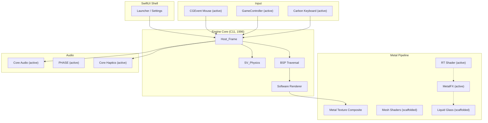

# Metal Quake

### A port of Quake to native Apple technologies.

> *A technical proof of concept exploring the rebuilding of a classic rendering and input engine entirely on Apple-native frameworks.*

---

## What This Is

**Metal Quake** maps id Software's original 1996 Quake engine onto native Apple technologies. No SDL. No OpenGL. No third-party dependencies.

This is an **active work-in-progress** that acts as a testbed for Apple platform APIs inside of an existing C codebase.

### Current State & Observations

- **Rendering**: Implements a hybrid architecture. When `vid_rtx 1` is active, BSP geometry and dynamic lights are path-traced in Metal. The original software renderer is maintained in parallel to establish precise Z-buffer depth, allowing software-rendered particles and sprites to correctly occlude against the ray-traced world before being composited onto the Metal view.
- **Input Robustness**: Mouse look exclusively relies on raw `CGEvent` deltas and programmatic cursor warping, forcefully establishing window focus to survive system-level event hijacking (such as `Cmd+Tab` or macOS screenshot overlays).
- **Stability Sacrifices**: Advanced ray-tracing post-processing features (volumetric god rays, depth of field, film grain) are currently disabled due to visual tracking artifacts and shader instability.
- **In Motion**: Mesh Shaders and Neural Upscaling/Denoising pipelines are scaffolded but remain inactive in the current build chain. 

---

## Feature Status

Features are categorized honestly:

- **Shipped** — Compiled, linked, and actively running in the game loop every frame
- **In Motion** — Built but disabled for stability, or partially integrated
- **Planned** — Design intent only, not compiled into binary

| Layer | Apple Framework | Status | What It Does |
| --- | --- | --- | --- |
| **Rendering** | Metal | Shipped | Metal device, texture pipeline, unified compositor with software elements |
| **Ray Tracing** | Metal RT | Shipped | BLAS from BSP geometry, RT intersection, dynamic GI + emissive surfaces |
| **Upscaling** | MetalFX | Shipped | Display scaling from internal resolution |
| **Legacy Audio** | Core Audio | Shipped | Lock-free ring buffer, async pull model |
| **Spatial Audio** | PHASE | Shipped | Per-frame listener position update (dual-engine alongside Core Audio) |
| **Mouse Input** | CGEvent | Shipped | Raw delta input, continuous cursor warping, robust focus survival |
| **Keyboard** | Carbon / NSEvent | Shipped | Full key mapping |
| **Controllers** | GameController | Shipped | DualSense + Xbox — sticks, triggers, D-pad |
| **Threading** | GCD | Shipped | `dispatch_apply` BSP leaf marking with atomic CAS |
| **Networking** | Network.framework | Shipped | UDP driver with NWConnection/NWListener |
| **UI** | SwiftUI | Shipped | NSPanel launcher overlay, full settings bridge to engine cvars |
| **Settings Sync** | UserDefaults | Shipped | Cross-syncs `@AppStorage` values to engine variables |
| **Neural Denoiser** | CoreML / ANE | In Motion | Call sites wired but gracefully skipped without ML models |
| **Texture Upscaling** | CoreML / ANE | In Motion | Call sites wired but gracefully skipped without ML models |
| **Mesh Shaders** | Metal 3.1 | In Motion | Shaders written but linker/toolchain issues temporarily block integration |
| **Post-Processing** | Metal Compute | In Motion | Liquid Glass, DoF, and Film Grain currently disabled for visual stability |

---

## Performance

Benchmarked on M4 Max, 640×480 internal resolution, software renderer + Metal compositing, `-nosound`:

| Demo | FPS | Description |
| --- | --- | --- |
| demo1 (e1m1) | **487** | The Slipgate Complex — tight corridors |
| demo2 (e1m4) | **283** | The Grisly Grotto — large open caverns |
| demo3 (loop) | **322** | Mixed indoor/outdoor geometry |

> [!NOTE]
> These benchmarks reflect the software renderer composited via Metal RT. Mesh shader and MetalFX pipelines are scaffolded but not yet active in the render pipeline evaluation.

---

## Architecture



---

## Build

```bash
./build.sh
./quake_metal -window -width 1920 -height 1080 +map e1m1
```

**Requirements:**
- Apple Silicon Mac (M1+)
- macOS 26.0 (Tahoe)
- Xcode 18+ Command Line Tools
- `id1/pak0.pak` (user-provided — no game assets included)

> [!CAUTION]
> This repository contains **no proprietary game assets**. You must provide your own `id1/pak0.pak`.

---

## Project Structure

```
Metal_Quake/
├── Quake/                        # Original id Tech 1 (C11, ~168 files)
│   └── sys_macos.m               # macOS system layer + event loop
├── src/macos/                    # Native Apple platform layer
│   ├── vid_metal.cpp             # Metal rendering + texture compositing
│   ├── rt_shader.metal           # RT intersection shader
│   ├── MQ_MeshShaders.metal      # Object/mesh/fragment pipeline (scaffolded)
│   ├── MQ_LiquidGlass.metal      # Refractive glass compositor (scaffolded)
│   ├── MQ_PHASE_Audio.m          # PHASE spatial audio
│   ├── MQ_CoreML.m               # Neural denoiser + upscaler (scaffolded)
│   ├── MQ_Ecosystem.m            # Game Center + SharePlay + Accessibility
│   ├── MetalQuakeLauncher.swift  # SwiftUI launcher
│   ├── net_apple.cpp             # Network.framework UDP driver
│   ├── snd_coreaudio.cpp         # Core Audio ring buffer
│   ├── in_gamecontroller.mm      # GameController + Haptics
│   ├── GCD_Tasks.m               # Parallel dispatch utilities
│   └── Sys_Tahoe_Input.mm        # Unified input architecture
├── metal-cpp/                    # Vendored Apple metal-cpp headers
├── build.sh                      # Single-command build (clang, arm64)
└── id1/                          # Game data (user-provided)
```

## Controller Mapping

Full gamepad support for DualSense, Xbox, and MFi controllers:

| Button | Action |
| --- | --- |
| Right Trigger | Fire |
| Left Trigger / A | Jump |
| Y / Right Bumper | Next weapon |
| Left Bumper | Previous weapon |
| B | Swim down |
| X | Use / Interact |
| Menu | Pause (Escape) |
| Left Stick | Move |
| Right Stick | Look |
| D-pad | Move (alternate) |

---

## Core Haptics — Per-Weapon Feedback

Every weapon has a distinct haptic profile tuned for its feel:

| Weapon | Intensity | Sharpness | Duration | Feel |
| --- | --- | --- | --- | --- |
| Axe | 0.6 | 0.9 | 50ms | Sharp thud |
| Shotgun | 0.7 | 0.6 | 80ms | Medium punch |
| Super Shotgun | 1.0 | 0.5 | 120ms | Heavy double-tap |
| Nailgun | 0.3 | 0.8 | 30ms | Light rapid |
| Super Nailgun | 0.4 | 0.7 | 40ms | Medium rapid |
| Grenade Launcher | 0.9 | 0.2 | 150ms | Deep thump |
| Rocket Launcher | 1.0 | 0.3 | 180ms | Heavy kick |
| Lightning Gun | 0.5 | 1.0 | 20ms | Sustained buzz |

Damage feedback scales proportionally. Nearby explosions produce distance-attenuated low-frequency feedback.

---

## License

**GPLv2** — Fork of the Quake source code originally released by id Software.

*Quake is a registered trademark of id Software / ZeniMax Media / Microsoft.*
