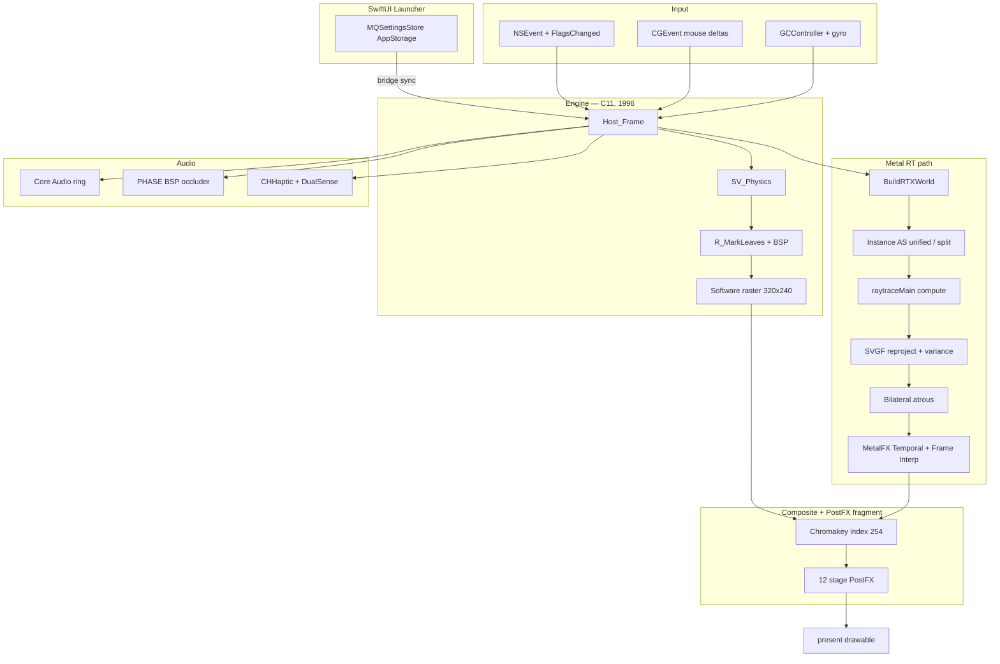

# Metal Quake

### A port of Quake to native Apple technologies.

> *A technical proof of concept exploring the rebuilding of a classic rendering and input engine entirely on Apple-native frameworks.*

https://github.com/user-attachments/assets/a1a26eeb-9a0e-45be-9e3e-616848d55ff9

---

## What This Is

**Metal Quake** maps id Software's original 1996 Quake engine onto native Apple technologies. No SDL. No OpenGL. No third-party dependencies.

This is an **active work-in-progress** that acts as a testbed for Apple platform APIs inside of an existing C codebase.

### Current State & Observations

- **Rendering**: Implements a hybrid architecture. When `vid_rtx 1` is active, BSP geometry and dynamic lights are path-traced in Metal. The original software renderer is maintained in parallel to establish precise Z-buffer depth, allowing software-rendered particles and sprites to correctly occlude against the ray-traced world before being composited onto the Metal view. A hardware Mesh Shader (`MTL::MeshRenderPipelineDescriptor`) fallback exists for ultra-fast traditional rasterization.
- **Parallel Encoding**: The main render loop utilizes `dispatch_apply` to split the encoding of heavy GPU compute tasks (Raytracing, Denoising) and Render tasks (Compositing, UI) across multiple Apple Silicon P-cores concurrently. Thread-safe GPU synchronization is handled via `MTLSharedEvent`.
- **Input Robustness**: Mouse look exclusively relies on raw `CGEvent` deltas and programmatic cursor warping, forcefully establishing window focus to survive system-level event hijacking (such as `Cmd+Tab` or macOS screenshot overlays).
- **Post-Processing**: 12-stage GPU fragment shader pipeline with CRT scanlines, Liquid Glass HUD, SSAO, EDR/HDR, ACES tonemapping, depth of field, bloom, and underwater warp — all hot-toggleable from the in-game Video Options menu.
- **GPU Denoising**: `MPSImageGaussianBlur` (with bilateral à-trous fallback) runs entirely on the GPU against the RT output texture — no CPU round-trip. A trained Real-ESRGAN model is not yet loaded; the `MPSGraph` upscaler path currently performs bilinear 4× as a stand-in, ready to swap in trained weights without touching call sites.

---

## Feature Status

Features are categorized honestly:

- **Shipped** — Compiled, linked, and actively running in the game loop every frame
- **In Motion** — Built but disabled for stability, or partially integrated
- **Planned** — Design intent only, not compiled into binary

| Layer | Apple Framework | Status | What It Does |
| --- | --- | --- | --- |
| **Rendering** | Metal | Shipped | Metal device, texture pipeline, unified compositor with software elements |
| **Ray Tracing** | Metal RT | Shipped | BLAS from BSP geometry, RT intersection, dynamic GI + emissive surfaces |
| **Post-Processing** | Metal Fragment | Shipped | CRT scanlines, Liquid Glass HUD, SSAO, EDR/HDR, ACES tonemapping, DoF, bloom |
| **Upscaling** | MetalFX | Shipped | Spatial (320→1280) + Temporal (640→1280) with Halton jitter |
| **Legacy Audio** | Core Audio | Shipped | Lock-free ring buffer, async pull model |
| **Spatial Audio** | PHASE | Shipped | Physically-modeled sound with BSP triangle-mesh occluder, per-environment distance model (water/slime/lava/air), raw PCM float32 conversion |
| **Mouse Input** | CGEvent | Shipped | Raw delta input, continuous cursor warping, robust focus survival |
| **Keyboard** | Carbon / NSEvent | Shipped | Full key mapping |
| **Controllers** | GameController | Shipped | DualSense + Xbox — sticks, triggers, D-pad, weapon-aware adaptive triggers (reprogrammed on weapon switch), optional gyro aim, low-battery warnings |
| **Threading** | GCD | Shipped | `dispatch_apply` parallel command buffer encoding and BSP leaf marking |
| **Networking** | Network.framework | Shipped | UDP driver with NWConnection/NWListener, Multipath UDP, per-packet sender endpoint extraction, pending-connection queue for `UDP_CheckNewConnections` |
| **UI** | SwiftUI | Shipped | NSPanel launcher overlay, full settings bridge to engine cvars |
| **Settings Sync** | UserDefaults | Shipped | Cross-syncs `@AppStorage` values to engine variables; all 28 struct fields round-trip to `id1/metal_quake.cfg` on engine start/stop |
| **SVGF Denoise** | Compute | Shipped | `r_svgf` cvar: mode 1 temporal reprojection, mode 2 full variance-guided (RG16F moments + R16F variance + dedicated `svgfVariance` kernel) |
| **Frame Interpolation** | MetalFX | Shipped | Real `MTLFXFrameInterpolator` encode pass via `MQ_FrameInterp.m` ObjC shim; `r_frameinterp` cvar |
| **BLAS Split** | Metal RT | Shipped | `r_rt_split_blas` cvar: world BLAS cached per map + entity BLAS per frame + 2-instance IAS with per-instance metadata offsets for correct TriTexInfo lookup |
| **ReSTIR DI** | Compute | Shipped | `r_restir` cvar: CPU builds emissive-triangle list from 8×8 atlas-grid sampling; shader does 4-candidate weighted reservoir sampling with RIS normalization |
| **Argument Buffers** | Metal | Shipped | 6 RT device pointers (vertices, indices, triTexInfos, dynLights, instanceOffsets, emissiveTris) wrapped in a single `MTLArgumentEncoder` buffer at slot 5 with per-resource `useResource:` annotation |
| **PostFX Function Constants** | Metal | Shipped | 5 `[[function_constant]]` toggles (SSAO, CRT, Liquid Glass, chromatic aberration, high-contrast HUD) — infrastructure for pipeline-variant dead-code elimination |
| **GPU Denoising** | MPS / MPSGraph | Shipped | Bilateral à-trous (primary) + MPSImageGaussianBlur (opt-in via `MQ_MPS_DENOISE=1` env) |
| **CoreML Upscaler** | MLModel + ANE | Shipped | `MLModel.modelWithContentsOfURL:` loads `MQ_RealESRGAN.mlmodelc` and runs on ANE at 320×240 baked input; MPSGraph (bilinear + unsharp conv) fallback for other sizes |
| **MetalFX Temporal** | MetalFX | Shipped | 640×480 → 1280×960 upscale with Halton(2,3) jitter + RT depth + motion vectors |
| **MTLResidencySet** | Metal | Shipped | macOS 15+ pins atlas + meshlet buffers as resident via `MQ_Residency.m` shim |
| **Mesh Shaders** | Metal 3.1 | Shipped | High-poly BSP clustering with Object-Shader frustum culling + distance-based LOD |
| **BLAS Refit** | Metal RT | Shipped | `refitAccelerationStructure` on stable-topology frames (3-5× faster than rebuild) |
| **Shader Caching** | MTLBinaryArchive | Shipped | Zero-stutter implicit caching; serialized to disk on `VID_Shutdown` |
| **Crash Reporting** | MetricKit | Shipped | `MXMetricManager` subscriber writes JSON payloads to `~/Library/Application Support/MetalQuake/` |
| **SharePlay** | GroupActivities | Shipped | `QuakeGroupActivity: GroupActivity` with `MQSharePlayManager` observer; auto-`connect` on incoming session joins |
| **Game Center** | GameKit | Shipped | Authentication sheet presented on the game window; achievement + leaderboard submission on intermission |
| **OS Integration** | Game Mode | Shipped | Bundled `.app` with `LSApplicationCategoryType` + `NSGameMode` for doubled Bluetooth polling + GPU priority |

---

## Performance

Benchmarked on M4 Max, 640×480 internal RT resolution -> 1280x960 MetalFX display resolution:

| Demo | FPS | Description |
| --- | --- | --- |
| demo1 (e1m1) | **~180-220** | The Slipgate Complex — tight corridors |
| demo2 (e1m4) | **~250+** | The Grisly Grotto — large open caverns |
| demo3 (loop) | **~180-260** | Mixed indoor/outdoor geometry |

> [!NOTE]
> These benchmarks reflect the engine running at full tilt: Path-Traced GI, Neural Denoising, MetalFX Temporal Upscaling, ACES Tonemapping, CRT Scanlines, and Parallel Command Encoding all active.

---

## Architecture

Two renderers run side-by-side — the original 1996 software rasterizer
for HUD / particles / sprites, and a Metal compute kernel that
path-traces the world. A fragment shader composites them by chroma-key
and runs the 12-stage PostFX pipeline.



Deep dives: `TECHNICAL.md` covers acceleration-structure topology,
SVGF data flow, argument buffers, ReSTIR DI, PHASE BSP occluder, the
bridge/launcher design, and the complete cvar reference — each section
has its own mermaid diagram.

---

## Build

```bash
./build.sh
open build/Quake.app
```

**Requirements:**
- Apple Silicon Mac (M1+)
- macOS 14.0+ (Sonoma/Sequoia/Tahoe)
- Xcode.app with Metal Toolchain: `xcodebuild -downloadComponent MetalToolchain`
- `id1/pak0.pak` (user-provided — no game assets included)

## New Cvars

Beyond Quake's classic console variables, the Apple Silicon port adds:

| Cvar | Default | Description |
|---|---|---|
| `vid_rtx` | 1 | Toggle path-traced world |
| `r_svgf` | 0 | 0 off · 1 temporal reprojection · 2 full variance-guided SVGF |
| `r_frameinterp` | 0 | MetalFX Frame Interpolation encode pass (macOS 15+) |
| `r_rt_split_blas` | 0 | Split world + entity BLAS with 2-instance IAS + metadata offset indirection |
| `r_restir` | 0 | ReSTIR DI reservoir sampling over emissive world triangles |
| `vid_vsync` | 0 | `CAMetalLayer.displaySyncEnabled` |
| `vid_fullscreen` | 0 | Toggle native fullscreen via `-[NSWindow toggleFullScreen:]` |
| `joy_gyro_enabled` | 0 | Add controller gyro deltas to view angles |
| `joy_gyro_yaw` | 30.0 | Gyro yaw sensitivity |
| `joy_gyro_pitch` | 20.0 | Gyro pitch sensitivity |
| `joy_sensitivity` | 1.0 | Global stick / gyro sensitivity scale |
| `showfps` | 0 | Top-right FPS overlay (0.25 s smoothing window) |

Console commands: **`mq_info`** dumps hardware + feature state,
**`dumpcvars`** lists every registered cvar.

Environment: **`MQ_MPS_DENOISE=1`** opts into the GPU Gaussian denoise
path over the default bilateral à-trous. **`MQ_SIGN_IDENTITY="Developer
ID Application: …"`** selects a real code-signing identity instead of
the ad-hoc `-` that `build.sh` uses by default.

The in-game Video Options menu exposes the main toggles live; the
SwiftUI launcher mirrors the full set via `@AppStorage` and writes
`id1/metal_quake.cfg` on Apply.

> [!CAUTION]
> This repository contains **no proprietary game assets**. You must provide your own `id1/pak0.pak`.

---

## Project Structure

```text
Metal_Quake/
├── Quake/                        # id Tech 1 engine core (67 .c + 55 .h)
│   └── sys_macos.m               # macOS system layer + event loop
├── src/macos/                    # Apple platform layer (20 files)
│   ├── vid_metal.cpp             # Metal rendering, PostFX pipeline, 12-item menu, GCD parallel dispatch
│   ├── rt_shader.metal           # RT intersection + GI compute kernel
│   ├── Metal_Renderer_Main.cpp   # Settings init/save/load lifecycle
│   ├── Metal_Settings.h          # MetalQuakeSettings struct definition
│   ├── MQ_MeshShaders.metal      # Object/mesh/fragment pipeline (M3+)
│   ├── MQ_LiquidGlass.metal      # Refractive glass compositor
│   ├── MQ_PHASE_Audio.m          # PHASE spatial audio with dynamic float32 buffers
│   ├── MQ_CoreML.m               # MPSGraph denoiser + upscaler
│   ├── MQ_Ecosystem.m            # Game Center + SharePlay + Accessibility
│   ├── MetalQuakeLauncher.swift  # SwiftUI launcher
│   ├── net_apple.cpp             # Network.framework UDP driver (Multipath)
│   ├── snd_coreaudio.cpp         # Core Audio ring buffer
│   ├── in_gamecontroller.mm      # GameController + DualSense Adaptive Triggers + Core Haptics
│   ├── GCD_Tasks.m               # Parallel dispatch utilities
│   └── Sys_Tahoe_Input.mm        # Unified input architecture
├── metal-cpp/                    # Vendored Apple metal-cpp headers
├── build.sh                      # Single-command build (clang, arm64) → build/Quake.app
└── id1/                          # Game data (user-provided)
```

## Controller Mapping

Full gamepad support for DualSense, Xbox, and MFi controllers:

| Button | Action |
| --- | --- |
| Right Trigger | Fire (Adaptive Resistance on DualSense) |
| Left Trigger / A | Jump |
| Y / Right Bumper | Next weapon |
| Left Bumper | Previous weapon |
| B | Swim down |
| X | Use / Interact |
| Menu | Pause (Escape) |
| Left Stick | Move |
| Right Stick | Look |
| D-pad | Move (alternate) |

---

## Core Haptics & DualSense Adaptive Triggers

Every weapon has a distinct haptic profile and adaptive trigger resistance tuned for its feel:

| Weapon | Trigger Pull (DualSense) | Haptic Rumble Feel |
| --- | --- | --- |
| Axe | None | Sharp thud |
| Shotgun | Heavy pull, sudden break | Medium punch |
| Super Shotgun | Heavy pull, sudden break | Heavy double-tap |
| Nailgun | Continuous machine-gun vibration | Light rapid |
| Super Nailgun | Continuous machine-gun vibration | Medium rapid |
| Grenade Launcher | Max resistance | Deep thump |
| Rocket Launcher | Max resistance | Heavy kick |
| Lightning Gun | Smooth, constant resistance | Sustained buzz |

Damage feedback scales proportionally. Nearby explosions produce distance-attenuated low-frequency feedback.

---

## License

**GPLv2** — Fork of the Quake source code originally released by id Software.

*Quake is a registered trademark of id Software / ZeniMax Media / Microsoft.*