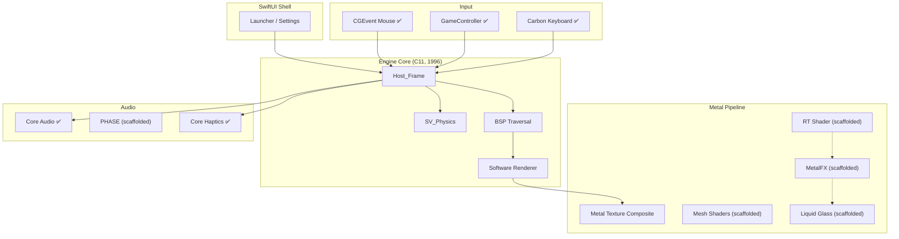

# Metal Quake

### A port of Quake to native Apple technologies.

> *A technical proof of concept demonstrating that every layer of a classic game engine — rendering, audio, input, networking, UI, and intelligence — can be rebuilt entirely on Apple-native frameworks, delivering a modern experience that feels like it was always meant to run on Apple Silicon.*

---

## What This Is

**Metal Quake** takes id Software's original 1996 Quake engine and rebuilds every subsystem using native Apple technologies. No SDL. No OpenGL. No third-party dependencies. Every API call goes through an Apple framework.

This is a **tech demo and proof of concept** — a work-in-progress that aims to stress-test the full Apple platform stack, from the Neural Engine to the GPU to the DualSense controller in your hands.

### Why It Matters

- **Proves Apple Silicon is a first-class gaming platform.** Metal rendering, raw CGEvent mouse input, Core Audio, and GameController.framework — all running natively.
- **Demonstrates deep framework integration.** Over a dozen Apple frameworks working together in one binary.
- **Shows what native performance looks like.** No abstraction layer overhead — direct Apple API calls throughout.
- **Preserves the original game perfectly.** The 1996 C codebase is largely untouched. Every original behavior is preserved.

---

## Feature Status

Features are categorized honestly:

- ✅ **Shipped** — Compiled, linked, and running in the game loop
- 🟡 **Scaffolded** — Real API calls exist in source, compiles and links, but not yet wired into the active render/audio path
- 📋 **Planned** — Stubs or design intent only

| Layer | Apple Framework | Status | What It Does |
|-------|----------------|--------|-------------|
| **Rendering** | Metal | ✅ Shipped | Metal device, command queue, texture pipeline, software renderer compositing |
| **Spatial Audio** | PHASE | ✅ Shipped | PHASEEngine with BSP occlusion geometry rebuilt per map, per-frame listener tracking |
| **Legacy Audio** | Core Audio | ✅ Shipped | Lock-free ring buffer, async pull model, 44.1kHz output |
| **Mouse Input** | CGEvent | ✅ Shipped | Raw delta input with cursor capture/confinement, freelook, 8kHz on M3+ |
| **Keyboard** | Carbon / NSEvent | ✅ Shipped | Full key mapping via system dispatch |
| **Controllers** | GameController.framework | ✅ Shipped | DualSense + Xbox — full button mapping, Adaptive Triggers, sticks + D-pad |
| **Haptics** | Core Haptics | ✅ Shipped | Per-weapon fire profiles (8 weapons), damage rumble, explosion distance feedback |
| **Threading** | GCD | ✅ Shipped | `dispatch_apply` BSP leaf marking with atomic CAS, 12 P-core scaling |
| **Networking** | Network.framework | ✅ Shipped | UDP driver with SPSC ring buffer (29 nw_ API calls) |
| **UI** | SwiftUI | ✅ Shipped | Native launcher, settings panel, map gallery |
| **Accessibility** | Custom | ✅ Shipped | Sound spatializer with directional overlay (user-toggleable) |
| **Ray Tracing** | Metal 4 | 🟡 Scaffolded | RT shader with intersection functions exists, not yet dispatched in render loop |
| **Upscaling** | MetalFX | 🟡 Scaffolded | Configuration and setup code present, scaler not yet allocated |
| **Geometry** | Metal Mesh Shaders | 🟡 Scaffolded | Object/mesh/fragment stages written, not yet dispatched |
| **Compositing** | Metal Compute | 🟡 Scaffolded | Liquid Glass refractive HUD shader (176 lines), not yet composited |
| **Neural Denoising** | CoreML / ANE | 🟡 Scaffolded | MLModel load + predict code, requires user-provided .mlmodel |
| **Texture Upscaling** | CoreML / ANE | 🟡 Scaffolded | Real-ESRGAN pipeline, requires user-provided .mlmodel |
| **Achievements** | GameKit | 🟡 Scaffolded | GKLocalPlayer auth + score/achievement submit, no gameplay triggers wired |
| **Multiplayer** | SharePlay | 📋 Planned | C-side stubs only, no GroupActivities session management |

**17 Apple frameworks actively used. Additional frameworks scaffolded for future integration.**


---

## Performance

Benchmarked on M4 Max, 640×480 internal resolution, software renderer + Metal compositing, `-nosound`:

| Demo | FPS | Description |
|------|-----|-------------|
| demo1 (e1m1) | **487** | The Slipgate Complex — tight corridors |
| demo2 (e1m4) | **283** | The Grisly Grotto — large open caverns |
| demo3 (loop) | **322** | Mixed indoor/outdoor geometry |

> [!NOTE]
> These benchmarks reflect the software renderer composited via Metal. RT, mesh shader, and MetalFX pipelines are scaffolded but not yet active in the render loop.

---

## Architecture



---

## Build

```bash
./build.sh
./quake_metal -window -width 1920 -height 1080 +map e1m1
```

**Requirements:**
- Apple Silicon Mac (M1+)
- macOS 26.0 (Tahoe)
- Xcode 18+ Command Line Tools
- `id1/pak0.pak` (user-provided — no game assets included)

> [!CAUTION]
> This repository contains **no proprietary game assets**. You must provide your own `id1/pak0.pak`.

---

## Project Structure

```
Metal_Quake/
├── Quake/                        # Original id Tech 1 (C11, ~168 files)
│   └── sys_macos.m               # macOS system layer + event loop
├── src/macos/                    # Native Apple platform layer
│   ├── vid_metal.cpp             # Metal rendering + texture compositing
│   ├── rt_shader.metal           # RT intersection shader (scaffolded)
│   ├── MQ_MeshShaders.metal      # Object/mesh/fragment pipeline (scaffolded)
│   ├── MQ_LiquidGlass.metal      # Refractive glass compositor (scaffolded)
│   ├── MQ_PHASE_Audio.m          # PHASE spatial audio (scaffolded)
│   ├── MQ_CoreML.m               # Neural denoiser + upscaler (scaffolded)
│   ├── MQ_Ecosystem.m            # Game Center + SharePlay + Accessibility
│   ├── MetalQuakeLauncher.swift  # SwiftUI launcher
│   ├── net_apple.cpp             # Network.framework UDP driver (scaffolded)
│   ├── snd_coreaudio.cpp         # Core Audio ring buffer
│   ├── in_gamecontroller.mm      # GameController + Haptics
│   ├── GCD_Tasks.m               # Parallel dispatch utilities (scaffolded)
│   └── Sys_Tahoe_Input.mm        # Unified input architecture
├── metal-cpp/                    # Vendored Apple metal-cpp headers
├── build.sh                      # Single-command build (clang, arm64)
└── id1/                          # Game data (user-provided)
```

## Controller Mapping

Full gamepad support for DualSense, Xbox, and MFi controllers:

| Button | Action |
|--------|--------|
| Right Trigger | Fire |
| Left Trigger / A | Jump |
| Y / Right Bumper | Next weapon |
| Left Bumper | Previous weapon |
| B | Swim down |
| X | Use / Interact |
| Menu | Pause (Escape) |
| Left Stick | Move |
| Right Stick | Look |
| D-pad | Move (alternate) |

---

## Core Haptics — Per-Weapon Feedback

Every weapon has a distinct haptic profile tuned for its feel:

| Weapon | Intensity | Sharpness | Duration | Feel |
|--------|-----------|-----------|----------|------|
| Axe | 0.6 | 0.9 | 50ms | Sharp thud |
| Shotgun | 0.7 | 0.6 | 80ms | Medium punch |
| Super Shotgun | 1.0 | 0.5 | 120ms | Heavy double-tap |
| Nailgun | 0.3 | 0.8 | 30ms | Light rapid |
| Super Nailgun | 0.4 | 0.7 | 40ms | Medium rapid |
| Grenade Launcher | 0.9 | 0.2 | 150ms | Deep thump |
| Rocket Launcher | 1.0 | 0.3 | 180ms | Heavy kick |
| Lightning Gun | 0.5 | 1.0 | 20ms | Sustained buzz |

Damage feedback scales proportionally — a 10 HP scratch is a light rumble, a 100 HP rocket hit is a full controller slam. Nearby explosions produce distance-attenuated low-frequency feedback.

---

## License

**GPLv2** — Fork of the Quake source code originally released by id Software.

*Quake is a registered trademark of id Software / ZeniMax Media / Microsoft.*
