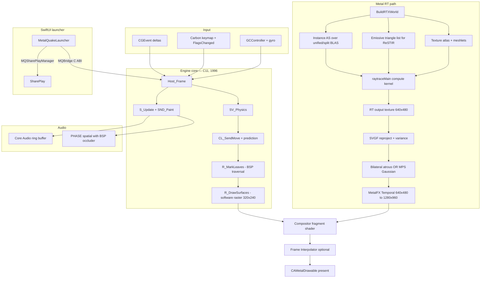
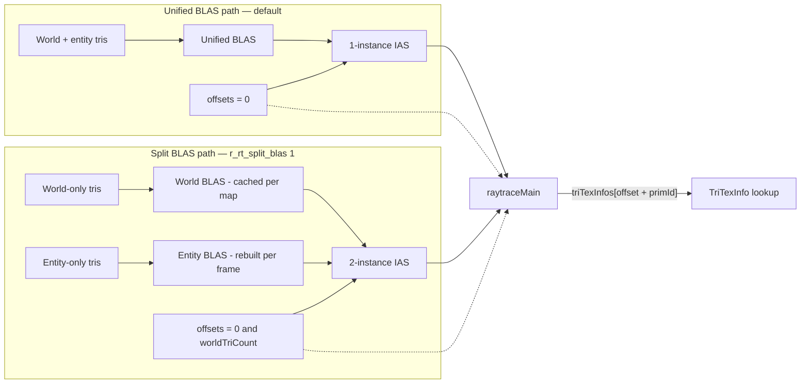
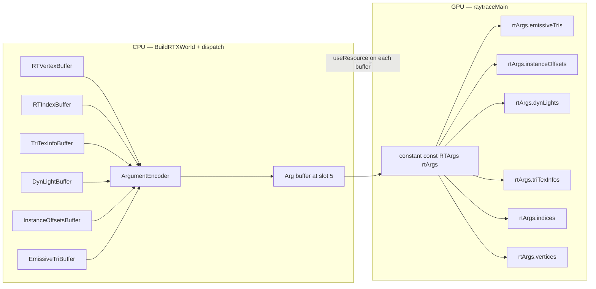
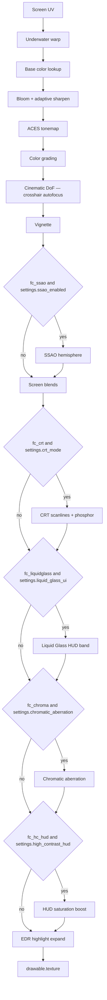
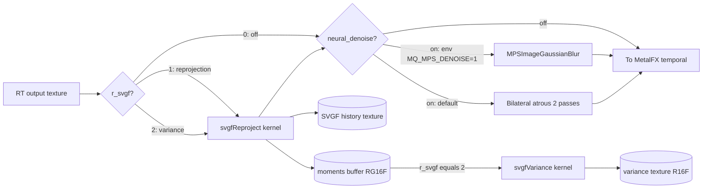
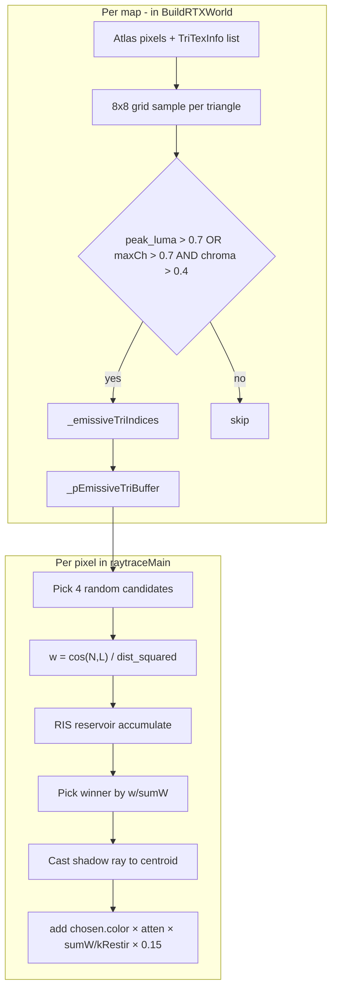
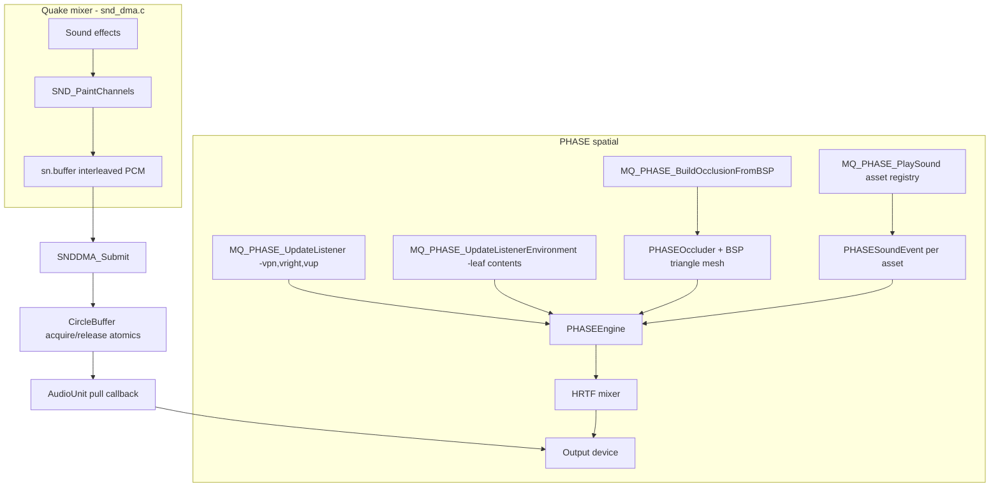
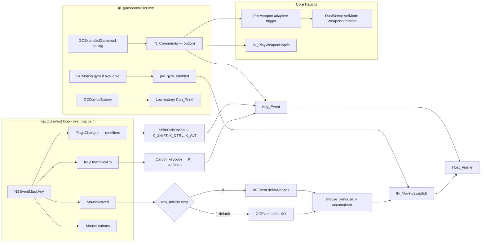
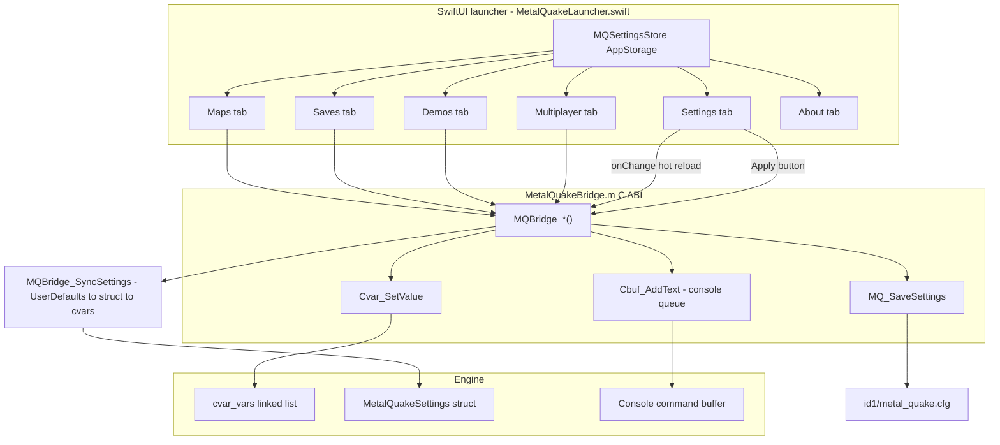
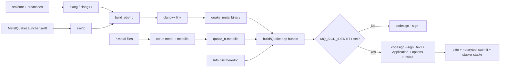

# Metal Quake — Technical Architecture

Deep dive into the engine architecture. This document covers what the code
does, why it's shaped that way, and the trade-offs behind each design
choice. For a feature-level summary of what's shipped, see `CHANGELOG.md`
and `PROGRESS.md`; for build / run steps see `README.md`.

## Top-level pipeline

The engine runs two renderers side-by-side and composites them through a
Metal fragment shader. The 1996 software rasterizer draws the HUD,
particles, and (when RT is off) the whole world; a Metal compute kernel
path-traces the world into a separate texture; the fragment shader picks
per-pixel which source to read based on a palette-index sentinel.



Every box that writes a Metal command buffer is on its own `MTLCommandBuffer`
with an `MTLSharedEvent` sync. The RT + denoise + temporal buffer (`pCmdCompute`)
runs in parallel with the composite + HUD buffer (`pCmdRender`); the render
side waits on a shared event before presenting the drawable so composite
tearing against a half-finished RT dispatch can't happen.

---

## 1. Hybrid rendering: software + RT + composite

The software renderer's output format (`indexTex`) is an 8-bit palette
index. Quake palette index **255** is the engine-wide "transparent" color
and is used as a chromakey. When `vid_rtx 1`:

- `R_RenderView` skips its 3D draw path and clears the world region of the
  8-bit framebuffer to palette index 254 (the RT sentinel).
- The 1996 raster still runs for particles, sprites, and HUD, using the
  software Z-buffer so occlusion against world geometry is correct.
- The compositor fragment shader reads `indexTex`, and if the index is 254
  it samples `rtTex` (the path-traced output) instead of the palette LUT.
  Pixels with any other index go through the normal palette conversion
  for the HUD / particles / sprites.

This keeps all the engine state (animations, particles, lightmaps,
monster AI) running exactly as 1996 Quake while upgrading only the world
surface to path-tracing.

---

## 2. Ray tracing acceleration structures

The RT shader takes an `instance_acceleration_structure` and a small
per-instance metadata offset buffer. There are two CPU-side paths that
target the same shader:



### Why the indirection

GEMINI.md §5 warns that naively splitting world and entity into
separate BLASes breaks the 1:1 mapping between `result.primitive_id` and
the global `triTexInfos[]` buffer — each BLAS reports primitive IDs local
to itself, so without a per-instance base offset you read the wrong
metadata for any instance after the first.

The fix: a 2-entry `uint` buffer (or 1-entry for the unified case) bound
at argument-buffer slot 4. For every `triTexInfos[]` access (main hit,
reflection hit, refraction hit, GI bounce hit) the shader does:

```metal
uint globalPrim = instanceOffsets[result.instance_id] + result.primitive_id;
TriTexInfo tti = triTexInfos[globalPrim];
```

The unified-BLAS path wraps the single BLAS in a 1-instance IAS with
`offset = [0]`, so `instance_id` is always 0 and the expression reduces
to `primId` — bit-identical behavior to the pre-IAS direct-BLAS case,
at the cost of one extra BVH traversal level the hardware handles natively.

### BLAS refit

On stable-topology frames (same triangle count as the prior frame) the
build path calls `refitAccelerationStructure` instead of a full rebuild,
which is 3-5× faster on Apple Silicon. Topology-change frames (map load,
entity count change) fall back to full rebuild.

### Intersector tag

The shader declares
```metal
intersector<triangle_data, instancing> isect;
```
The `instancing` tag is required — without it `result.instance_id` is
undefined for IAS hits, which is how the world first rendered black during
the IAS rollout. Caught via that exact symptom.

---

## 3. Argument buffers for the RT dispatch

The six RT device pointers (vertices, indices, triTexInfos, dynLights,
instanceOffsets, emissiveTris) are encoded into a single argument buffer
and bound at `[[buffer(5)]]`. Scalar uniforms (camera basis, time,
rtQuality, underwaterFlag, emissiveCount, useReSTIR) stay as direct
`setBytes` at their per-slot positions.



The argument encoder is derived once at `BuildPipeline` time from the
retained `MTL::Function*` for `raytraceMain`; the arg buffer is shared-
storage and repopulated each frame. `useResource:MTL::ResourceUsageRead`
on the compute encoder tells the driver to page each underlying buffer
in for the dispatch — without those calls the indirect pointer loads
would read zero.

---

## 4. Post-processing pipeline

The fragment shader runs 12 stages in a single pass per composite
drawable. Optional stages are guarded by 5 function constants so the
compiler dead-code-eliminates them when the matching setting is off:



The default pipeline built at `VID_Init` binds all five function constants
to `true` via `MTLFunctionConstantValues`, giving identical behavior to
the pre-specialization code. The infrastructure is ready for a
settings-hash-keyed pipeline cache that builds specialized variants on
demand — the variants just aren't wired to the cache yet.

---

## 5. Denoising pipeline

RT output hits up to three denoise passes depending on cvars.



### SVGF

Two compute kernels in a single shader library:

- **`svgfReproject`** reads current color + prior history + motion vectors.
  Warps the history through the motion vectors into current-frame screen
  space, blends current × history with an alpha reduced when the motion
  speed is large (disocclusion guard). Updates the moments buffer with
  running luma mean + mean-squared.
- **`svgfVariance`** reads the moments buffer, does a 3×3 box smooth, and
  writes `E[X²] − E[X]²` per pixel to a scalar R16F variance texture.
  Feeds the bilateral's color-stop modulation in modes that consume it.

The history + moments + variance textures are RT-resolution (640×480 by
default) private-storage Metal textures allocated at `VID_Init`.

### Bilateral à-trous

Two-pass edge-preserving filter with tightly-tuned sigmas (`sigmaColor =
0.035`, `sigmaDepth = 0.02`) and step widths 1, 2. The original 3-pass
step-width-4 was removed because it bled across pixel-art texel
boundaries, producing a visible "wrapped in plastic" look.

### CoreML / MPSGraph path

`MQ_CoreML_Init` tries to load `id1/MQ_Denoiser.mlmodelc` and
`id1/MQ_RealESRGAN.mlmodelc` via `MLModel.modelWithContentsOfURL:` with
`MLComputeUnitsAll` (ANE preferred). When present the upscaler path
calls `predictionFromFeatures:` against a baked 240×320 input shape,
routing pixels through `MLMultiArray` ↔ planar CHW float buffers.

Mismatched input sizes fall through to the MPSGraph path: bilinear 4× →
depthwise 3×3 unsharp conv → clamp, whose weights are identical to the
ones `scripts/create_coreml_models.py` bakes into the shipped
`.mlmodelc`. So swapping in a trained Real-ESRGAN model means replacing
the `.mlmodelc` bundle and nothing else.

---

## 6. ReSTIR DI over emissive surfaces

Reservoir-based many-light direct illumination. Quake's dynamic-light
array (`cl_dlights[]`) caps at 16 and is fully summed per-pixel — cheap.
The sampled-light targets are world surface triangles whose atlas centers
pass an emissive heuristic:



The `0.15` contribution scale is conservative so ReSTIR can't overpower
the existing BSP lightmap. The estimator is unbiased weighted-reservoir
importance sampling (WRIS) with `kRestir = 4` candidates.

---

## 7. ARM64 memory modernization

Engine limits scaled up for Apple Silicon's unified memory. The constants
live at their original file locations; what changed are the numeric
values.

| Constant       | Original | arm64  | File            | Rationale                        |
| -------------- | -------- | ------ | --------------- | -------------------------------- |
| Hunk memory    | 32 MB    | 256 MB | `sys_macos.m`   | Unified memory pool              |
| Zone memory    | 48 KB    | 512 KB | `zone.c`        | Dynamic allocation headroom      |
| Edge buffer    | 2,400    | 65,536 | `r_shared.h`    | Complex BSP geometry             |
| Surface buffer | 800      | 16,384 | `r_shared.h`    | Surface tracking                 |
| Span buffer    | 3,000    | 65,536 | `r_shared.h`    | Scanline rasterizer spans        |
| MAX_EDICTS     | 600      | 2,048  | `quakedef.h`    | L2-cache-friendly edict array    |
| MAX_PARTICLES  | 2,048    | 16,384 | `r_part.c`      | Rich effects                     |
| MAX_VISEDICTS  | 256      | 2,048  | `client.h`      | Visible entity count             |
| MAX_EFRAGS     | 640      | 4,096  | `client.h`      | Entity fragments                 |
| MAX_DLIGHTS    | 32       | 64     | `client.h`      | Dynamic lights                   |
| MAX_OSPATH     | 128      | 1,024  | `quakedef.h`    | macOS paths                      |
| MAX_MSGLEN     | 8,000    | 32,000 | `quakedef.h`    | Network messages                 |
| MAX_DATAGRAM   | 1,024    | 4,096  | `quakedef.h`    | Unreliable packets               |

### Stability hardening

- Static buffers: `ledges[]` / `lsurfs[]` moved from stack to BSS in
  `R_EdgeDrawing` — prevents 6 MB stack overflow on complex maps.
- `R_EmitEdge` includes a bounds check that returns early instead of
  corrupting the edge linked list.
- `r_dowarp` is forced `false` in `R_SetupFrame` — the legacy software
  `D_WarpScreen` path generated corrupt edge data causing infinite loops
  in `R_InsertNewEdges`. Underwater distortion is now handled by the
  Metal fragment shader's warp stage.

---

## 8. Audio

Two audio engines run in parallel. Core Audio handles the classic
Quake mixer output via a lock-free ring buffer; PHASE handles spatial
audio with real geometric occlusion.



### Core Audio ring buffer

`CircleBuffer` uses `std::atomic<uint32_t>` head/tail with
`memory_order_acquire`/`release` fences. A separate monotonic
`framesConsumed` counter lets `SNDDMA_GetDMAPos` report the right DMA
index to Quake's mixer — `head` alone is a position inside the proxy
ring, which is a different size than `sn.buffer`.

Sample rate queries the default output device's `kAudioDevicePropertyNominalSampleRate`
at `SNDDMA_Init` so modern 48 kHz output isn't resampled from 44.1 kHz.

### PHASE BSP occluder

`MQ_PHASE_BuildOcclusionFromBSP` walks `cl.worldmodel->surfaces`, filters
out sky/liquid faces, fan-triangulates each polygon, and builds an
`MDLMesh` wrapped in a `PHASEShape` + `PHASEOccluder`. The listener's
current leaf contents drives a `PHASEGeometricSpreadingDistanceModelParameters`
swap so underwater / lava / air all have distinct cull distances.

---

## 9. Input

Each input source feeds Quake's `Key_Event` + `IN_Move` callbacks.



Modifier keys arrive as `NSEventTypeFlagsChanged` events, not
KeyDown/KeyUp. The dispatch table translates bitmask transitions to
Quake's `Key_Event(K_SHIFT, down)` etc., which then populates
`shift_down` in `keys.c` so the console's `keyshift[]` table converts
`-` → `_`, `1` → `!`, etc. This is the code path the initial "underscore
doesn't work in console" bug landed on.

---

## 10. SwiftUI launcher ↔ engine bridge



### Settings persistence

- `Metal_Renderer_Main.cpp` owns `MetalQuakeSettings* MQ_GetSettings()`.
- `MQ_InitSettings` populates defaults.
- `MQ_LoadSettings("id1/metal_quake.cfg")` runs at `Host_Init` — parses
  key/value lines, skipping `//` comments (the comment-line bug caught
  by `tests/test_settings.cpp` was that `fscanf` aborted on the header).
- `MQ_SaveSettings` writes all 28 struct fields on shutdown and after
  Apply-button clicks.
- The SwiftUI side uses `@AppStorage` keys prefixed `mq_*`;
  `MQBridge_SyncSettings` reads them into the C struct and pushes into
  cvars.

### Console command interplay

The Maps / Saves / Demos / Multiplayer tabs all funnel through
`Cbuf_AddText` rather than calling engine primitives directly — they
queue console commands like `map e1m1`, `load quick`, `playdemo demo1`,
`connect 192.168.1.5:27500`. This ensures every UI action is also
reachable from the console and goes through Quake's normal command
parsing.

### SharePlay

`QuakeGroupActivity: GroupActivity` is declared in the Swift launcher
with `@objc(MQSharePlayManager)` pinning so `NSClassFromString` can find
the ObjC-exported class. The C bridge in `MQ_Ecosystem.m` looks up the
class by name and calls `observeIncoming` / `startSession(serverAddress:mapName:)`
via `performSelector:` / `NSInvocation` so the engine never has to link
Swift concurrency directly.

---

## 11. Build & distribution



The build script (`./build.sh`) does incremental compile via source-file
mtimes, weak-links MetalFX + PHASE so older macOS versions boot but
degrade, and generates the bundle's `Info.plist` via a heredoc. Metal
shaders compile through `xcrun metal`; the Metal Toolchain is a separate
Xcode download (`xcodebuild -downloadComponent MetalToolchain`) on
macOS 15+.

---

## 12. Test harness

`tests/run.sh` compiles + runs each `test_*.cpp` as a standalone
executable. Tests that reference `MQ_GetSettings` / `MQ_SaveSettings`
auto-link `Metal_Renderer_Main.cpp`; others (like the address-compare
semantics test) are self-contained.

Current coverage:

| Test                  | Lines    | Catches                                      |
| --------------------- | -------- | -------------------------------------------- |
| `test_settings.cpp`   | 34 fields| `MQ_Save`/`MQ_Load` round trip + defaults    |
| `test_addr.cpp`       | 4 cases  | `UDP_AddrCompare` semantics contract         |

The settings test caught a real regression: the fscanf loop in
`MQ_LoadSettings` was aborting at the top-of-file `//` comment line,
silently dropping every saved setting on load. The line-oriented `fgets`
+ comment-skip rewrite is what replaced it.

---

## 13. Cvar reference

New cvars introduced by the Apple Silicon port (beyond Quake's 1996 set):

| Cvar                   | Default | Where                          | Effect                                                        |
| ---------------------- | ------- | ------------------------------ | ------------------------------------------------------------- |
| `vid_rtx`              | 1       | `vid_metal.cpp`                | Toggle path-tracing world                                     |
| `r_svgf`               | 0       | `vid_metal.cpp`                | 0 off, 1 reprojection, 2 full variance-guided                 |
| `r_frameinterp`        | 0       | `vid_metal.cpp`                | MetalFX Frame Interpolation                                   |
| `r_rt_split_blas`      | 0       | `vid_metal.cpp`                | Split world + entity BLAS with instance offsets               |
| `r_restir`             | 0       | `vid_metal.cpp`                | ReSTIR DI over emissive world triangles                       |
| `vid_vsync`            | 0       | `vid_metal.cpp`                | `CAMetalLayer.displaySyncEnabled`                             |
| `vid_fullscreen`       | 0       | `vid_metal.cpp`                | `-[NSWindow toggleFullScreen:]`                               |
| `joy_gyro_enabled`     | 0       | `in_gamecontroller.mm`         | Add controller gyro deltas to view                            |
| `joy_gyro_yaw`         | 30      | `in_gamecontroller.mm`         | Gyro yaw sensitivity                                          |
| `joy_gyro_pitch`       | 20      | `in_gamecontroller.mm`         | Gyro pitch sensitivity                                        |
| `joy_sensitivity`      | 1.0     | `in_gamecontroller.mm`         | Stick/controller global scale                                 |
| `showfps`              | 0       | `screen.c`                     | Top-right FPS overlay (0.25s smoothed)                        |

Settings-struct-driven (set via launcher or in-game menu rather than
raw cvar): `fov`, `gamma`, `hud_scale`, `crt_mode`, `ssao_enabled`,
`edr_enabled`, `underwater_fx`, `liquid_glass_ui`, `chromatic_aberration`,
`high_contrast_hud`, `neural_denoise`, `mesh_shaders`, `spatial_audio`,
`audio_mode`, `master_volume`, `music_volume`, `haptic_intensity`,
`controller_deadzone`, `raw_mouse`, `invert_y`, `auto_aim`,
`mouse_sensitivity`, `rt_quality`, `metalfx_mode`, `metalfx_scale`,
`coreml_textures`, `subtitles`.

Console commands: `mq_info` dumps current state, `dumpcvars` lists every
registered cvar.

---

## 14. Deferred / honest scope-outs

| Item                                      | Status                              | Why                                                                                     |
| ----------------------------------------- | ----------------------------------- | --------------------------------------------------------------------------------------- |
| PostFX pipeline cache over 5 FCV variants | Infrastructure in place, cache stub | The 5 function constants specialize but the cache-keyed lookup isn't wired yet          |
| Trained Real-ESRGAN weights               | Load path ready                     | `.mlmodelc` is deterministic conv; trained weights need a training pipeline we don't run|
| macOS Game Mode assertions                | Info.plist category set             | Gates require runtime assertion + Game Center sign-in                                   |
| App Sandbox entitlements                  | Not configured                      | Distribution via Mac App Store would need a sandbox plist + access prompts              |
